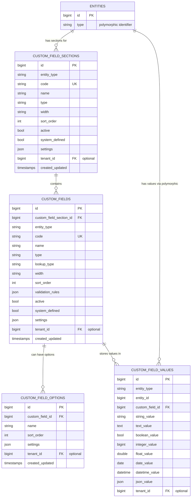

## **Architecture Overview**

The Custom Fields plugin employs a **Hybrid Entity-Attribute-Value (EAV) with Type Polymorphism** design that balances flexibility with performance. Unlike traditional EAV models that suffer from type conversion overhead and poor query performance, this architecture uses typed storage columns and strategic indexing to maintain database-level optimizations while enabling dynamic field creation.



## **Design Philosophy**

### **Type-Safe Flexibility**
The schema uses multiple typed columns in `custom_field_values` rather than a single text column. This eliminates costly type conversions, enables native database sorting/filtering, and maintains data integrity through database-level constraints. When you store an integer, it's actually stored as an integer—not a string that needs parsing.

### **Hierarchical Organization** 
Fields are organized into sections, providing logical grouping essential for complex forms. This two-level hierarchy supports progressive disclosure in UIs and administrative organization without adding complexity to simple use cases.

### **Performance-First Indexing**
Strategic composite indexes optimize the most common query patterns: entity lookup, field discovery, and polymorphic joins. The schema is designed for the queries you'll actually run, not theoretical completeness.

## **Why This Schema Design**

**Polymorphic Flexibility**: Any model can have custom fields without tight coupling or migration dependencies. Add custom fields to `Product`, `User`, `Order`—anything implementing the `HasCustomFields` interface.

**Multi-Tenant Isolation**: Optional tenant awareness is built into the core schema, not bolted on later. When enabled, all data is automatically isolated between tenants while maintaining query performance.

**Extensible Field Types**: Field types are pluggable through a clean interface. The `settings` JSON column provides unlimited extension points without schema changes.

**Efficient Querying**: Unlike traditional EAV models, this design supports efficient filtering and sorting on custom field values using native database types and proper indexing strategies.

## **Developer Usage Patterns**

### **Entity Integration**
```php
class Product extends Model implements HasCustomFields
{
    use UsesCustomFields;
    
    // Custom fields automatically available
    // Values properly typed on retrieval
}
```

### **Type-Safe Operations** 
```php
// Automatic type-safe storage
$product->saveCustomFieldValue($field, 24); // Stored in integer_value column

// Type-safe retrieval  
$value = $product->getCustomFieldValue($field); // Returns integer, not string
```

### **Optimized Queries**
```php
// Efficient custom field filtering
$products = Product::withCustomFieldValues()
    ->whereHas('customFieldValues', function($query) {
        $query->where('custom_field_id', $fieldId)
              ->where('integer_value', '>', 12);
    })->get();
```

## **Performance Considerations**

This schema excels with complex forms, multi-tenant applications, and admin interfaces requiring dynamic field management. The typed storage and strategic indexing make it suitable for production applications with significant data volumes.

Consider the performance implications for sparse data (many NULL values) and plan custom queries for complex cross-field reporting needs. The architecture prioritizes the common case: efficient field definition, value storage/retrieval, and entity-centric queries.

## **Multi-Tenancy Support**

When enabled, `tenant_id` is included in all unique constraints and automatically filtered through model scopes. This ensures complete data isolation while maintaining query performance through proper indexing.

