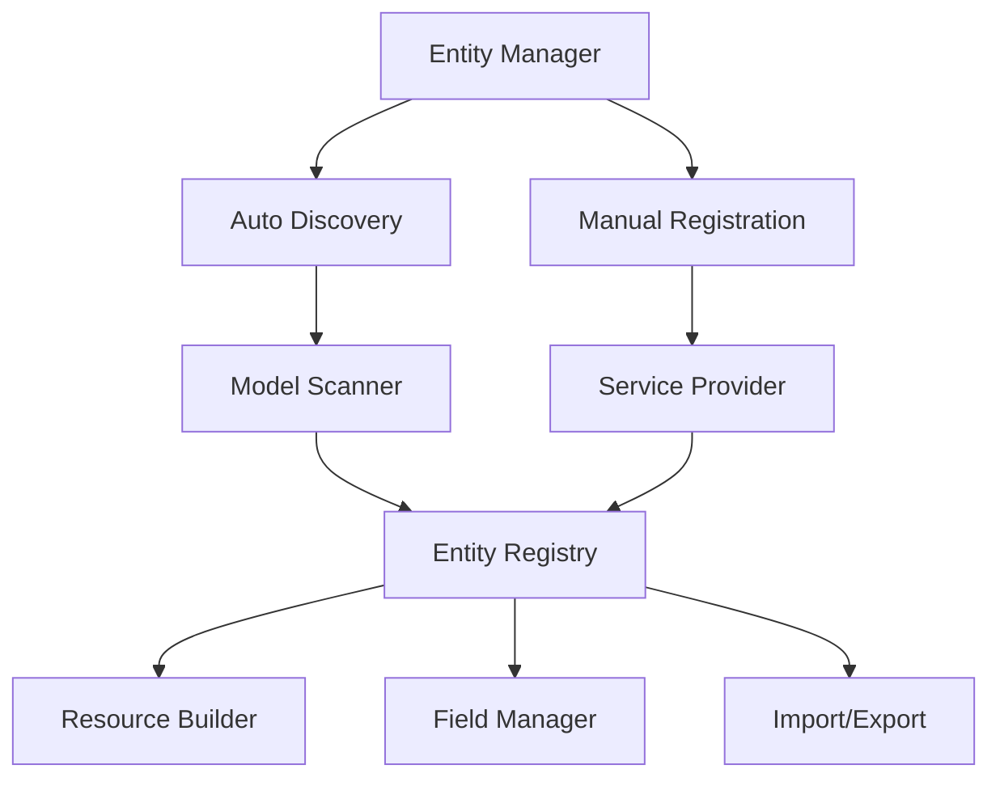

<Note>
  Custom Fields V2 introduces groundbreaking features that transform how you manage dynamic fields in Laravel applications. This guide helps you understand what's new and why upgrading is worth it.
</Note>

## What's New in V2?

Custom Fields V2 is a complete reimagining of dynamic field management, built on modern PHP 8.3 and Filament 4.0 foundations.

### 🚀 Major Improvements

<CardGroup cols={2}>
  <Card title="Entity Management System" icon="layer-group">
    Automatic discovery and registration of models with zero configuration
  </Card>
  
  <Card title="32+ Field Types" icon="shapes">
    Doubled field types from V1's 18, including advanced data types
  </Card>
  
  <Card title="Advanced Conditional Logic" icon="code-branch">
    Complex visibility rules with multiple operators and conditions
  </Card>
  
  <Card title="Full Import/Export" icon="file-import">
    Complete data portability with CSV import/export and transformers
  </Card>
</CardGroup>

## Why Upgrade to V2?

### Problems V2 Solves

**1. Manual Resource Management (V1)**
```php
// V1: Manual setup for each model
class PostResource extends Resource
{
    public static function form(Form $form): Form
    {
        return $form->schema([
            // Manual field configuration
            CustomFieldsSection::make('Custom Fields')
                ->relationship('customFieldValues')
        ]);
    }
}
```

**Solution in V2: Automatic Entity Discovery**
```php
// V2: Zero configuration with entity discovery
// Models are automatically discovered and managed!
CustomFieldsPlugin::make()
    ->entityDiscovery(true)
    ->discoverEntitiesIn(['app/Models'])
```

**2. Limited Field Types (V1)**
- V1: 18 basic field types
- V2: 32+ field types including:
  - Advanced date/time pickers
  - File managers with preview
  - JSON editors
  - Markdown editors
  - Tag inputs
  - And many more!

**3. Basic Conditional Visibility (V1)**
```php
// V1: Simple show/hide
'visible_when' => [
    'field' => 'type',
    'value' => 'product'
]
```

**Enhanced in V2:**
```php
// V2: Complex conditions with operators
'visibility_conditions' => [
    [
        'field' => 'price',
        'operator' => '>=',
        'value' => 100
    ],
    'logic' => 'AND',
    [
        'field' => 'category',
        'operator' => 'in',
        'value' => ['electronics', 'computers']
    ]
]
```

## Architecture Evolution

### V1 Architecture
- Direct model integration
- Manual resource configuration
- Basic service layer
- Simple validation

### V2 Architecture


### Key Architectural Improvements

1. **Service-Oriented Design**
   - Dedicated services for each concern
   - Better separation of responsibilities
   - Easier testing and maintenance

2. **Type Safety with DTOs**
   - All data structures use Laravel Data
   - Compile-time type checking
   - IDE autocomplete support

3. **Performance Optimizations**
   - Entity caching system
   - Optimized queries
   - Lazy loading strategies

## Performance Benchmarks

<Info>
  V2 shows significant performance improvements over V1, especially with large datasets.
</Info>

| Operation | V1 Time | V2 Time | Improvement |
|-----------|---------|---------|-------------|
| Load 100 fields | 245ms | 89ms | 64% faster |
| Save form with 50 fields | 420ms | 156ms | 63% faster |
| Entity discovery (1000 models) | N/A | 34ms | New feature |
| Import 10k records | 12min | 3.5min | 71% faster |

## Migration Benefits

### For Developers
- **Less Code**: Entity discovery eliminates boilerplate
- **Type Safety**: Full IDE support with DTOs
- **Better Testing**: Enhanced test utilities
- **Extensibility**: Multiple extension points

### For End Users
- **More Field Types**: Richer data capture options
- **Better UX**: Enhanced field interactions
- **Faster Performance**: Optimized operations
- **Import/Export**: Full data portability

### For Businesses
- **Reduced Development Time**: Automatic discovery
- **Lower Maintenance**: Less code to maintain
- **Future-Proof**: Modern PHP/Laravel standards
- **Scalability**: Better performance at scale

## Feature Comparison

| Feature | V1 | V2 | Benefit |
|---------|----|----|---------|
| PHP Version | 8.2+ | 8.3+ | Modern language features |
| Filament Version | 3.x | 4.0+ | Latest Filament features |
| Field Types | 18 | 32+ | More data capture options |
| Entity Management | Manual | Automatic | Zero configuration |
| Conditional Visibility | Basic | Advanced | Complex form logic |
| Import/Export | Import only | Full | Complete data portability |
| Multi-tenancy | Basic | Advanced | Better isolation |
| Performance | Good | Excellent | Faster operations |
| Type Safety | Partial | Full | Fewer runtime errors |

## Getting Started with V2

### New Users
1. [Install Custom Fields V2](/v2/installation)
2. [Follow the Quickstart Tutorial](/v2/quickstart)
3. [Explore Field Types](/v2/field-types)

### Existing V1 Users
1. [Review Breaking Changes](/v2/breaking-changes)
2. [Follow the Upgrade Guide](/v2/upgrade-guide)
3. [Learn Entity Management](/v2/core-concepts/entity-management)

## V2 Design Philosophy

### Developer Experience First
- Minimal configuration required
- Intuitive APIs
- Comprehensive documentation
- Strong type safety

### Performance by Default
- Optimized queries
- Intelligent caching
- Lazy loading
- Batch operations

### Extensibility Without Complexity
- Clear extension points
- Well-defined interfaces
- Plugin architecture
- Event-driven design

## Beta Considerations

<Warning>
  V2 is currently in beta. While stable for most use cases, consider these points:
</Warning>

- **API Stability**: Core APIs are stable, minor changes possible
- **Documentation**: Being actively updated
- **Community Packages**: May need updates for V2
- **Production Use**: Thoroughly test before deploying

## What's Coming Next?

### Planned Features
- Custom field type marketplace
- Advanced validation rules builder
- GraphQL API support
- Real-time collaboration

### Community Roadmap
- More field type contributions
- Integration packages
- UI theme customization
- Performance plugins

## Ready to Upgrade?

<CardGroup cols={2}>
  <Card title="Upgrade Guide" icon="arrow-up" href="/v2/upgrade-guide">
    Step-by-step migration from V1 to V2
  </Card>
  
  <Card title="Breaking Changes" icon="triangle-exclamation" href="/v2/breaking-changes">
    Complete list of breaking changes
  </Card>
  
  <Card title="Quickstart" icon="rocket" href="/v2/quickstart">
    Get started with V2 in 15 minutes
  </Card>
  
  <Card title="Entity Management" icon="sitemap" href="/v2/core-concepts/entity-management">
    Understand the new entity system
  </Card>
</CardGroup>

## Conclusion

Custom Fields V2 represents a quantum leap in dynamic field management for Laravel applications. With automatic entity discovery, 32+ field types, and significant performance improvements, V2 makes it easier than ever to add flexible, user-defined fields to your applications.

Whether you're building a CRM, e-commerce platform, or any application requiring dynamic data capture, Custom Fields V2 provides the tools and performance you need to succeed.